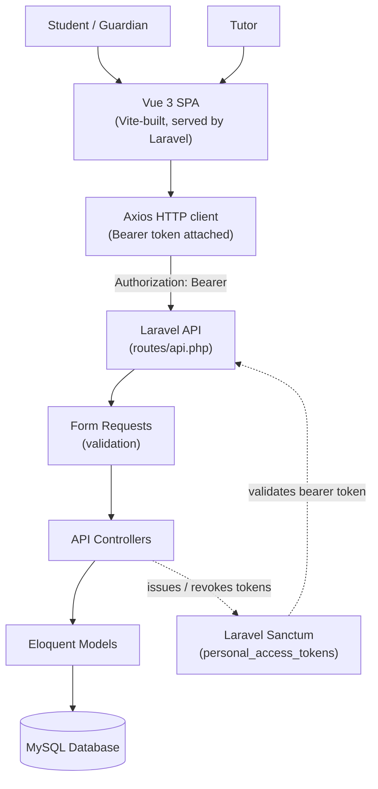
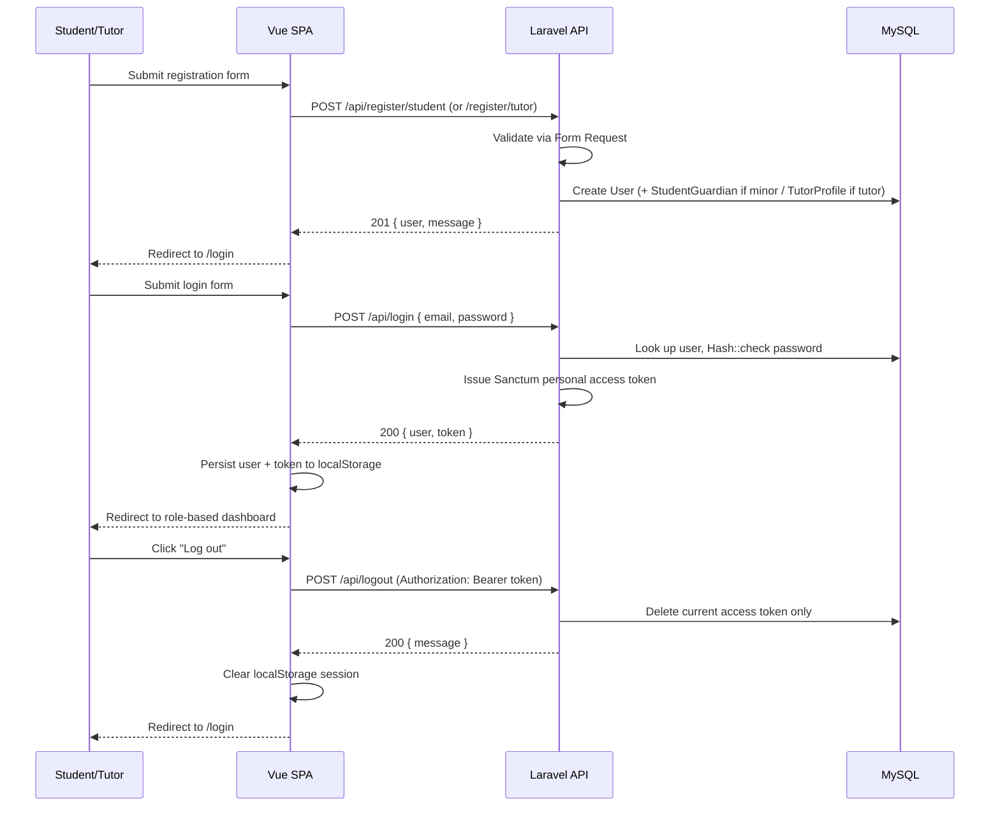
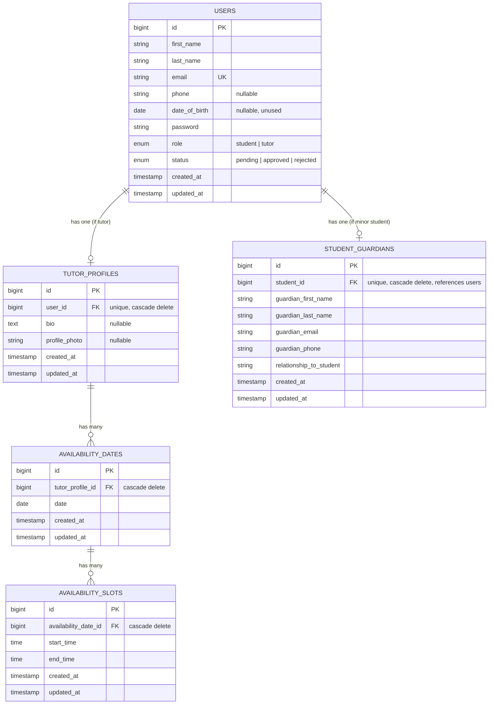
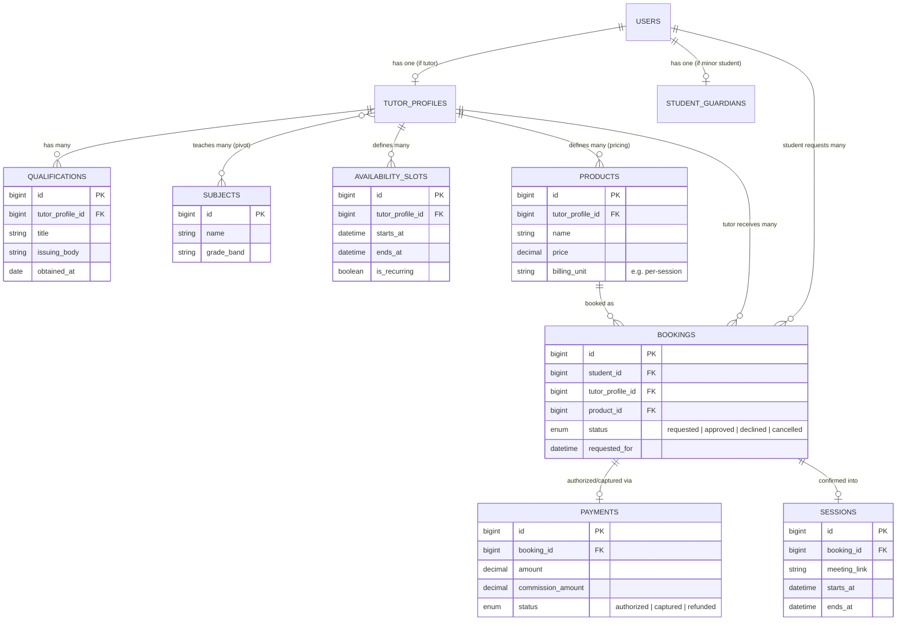

# Learning Platform — Architecture Reference

**Status:** Living document. **Audience:** human engineers and AI coding assistants working on this repository.

This document is the authoritative technical and business reference for the Learning Platform. It reflects the codebase as inspected on **2026-07-15**. Every claim in the "Current Implementation" and other non-"Planned" sections was verified directly against the source tree at that time — nothing here is aspirational unless explicitly labeled **Planned**.

> **Rule for maintainers (human or AI):** if you change the architecture, update this document in the same change set. If a section describes something not yet built, it must say so explicitly under a "Planned" heading. Never blend planned and implemented functionality in the same sentence without a clear qualifier.

---

## 1. Project Overview

### 1.1 What this is

The Learning Platform is a **Teacher-Led Learning Platform** focused on **Grade 8–12 (high school) education**. It connects independent tutors ("guides") with students who need subject-specific academic support, and — where the student is a minor — their guardians.

### 1.2 Business vision

The platform's role is to be the **marketplace and operating layer** for independent tutoring, not the teacher. Concretely:

- **Tutors own their product.** A tutor decides what subjects they teach, how they teach, what they charge, and when they are available. The platform does not dictate curriculum or pricing.
- **The platform owns the marketplace mechanics.** Discovery, trust (verification, ratings), scheduling, payment handling, and session delivery infrastructure (e.g. meeting links) are the platform's responsibility, so tutors can focus on teaching rather than running a business.
- **Trust and safety are structural, not optional.** Because the platform serves minors (Grade 8–12 students, many under 18), guardian involvement is a first-class concern baked into registration itself, not bolted on later.

### 1.3 How this differs from a traditional LMS

A traditional Learning Management System (LMS) is typically **institution-led**: a school or organization defines the curriculum, enrolls students, and tutors/teachers deliver content that the institution owns. This platform inverts that model:

| Traditional LMS | This Platform |
|---|---|
| Institution defines the courses | Tutor defines their own offerings |
| Students are enrolled by an administrator | Students discover and choose tutors directly |
| Curriculum is centrally owned | Tutors own their teaching product and materials |
| Pricing is set by the institution | Pricing is **product-driven**, set by each tutor (planned — see §7, §8) |
| Platform is the content authority | Platform is a **marketplace and enablement layer** |

### 1.4 Long-term business objectives

- Become the primary marketplace for independent, high-school-level tutoring.
- Let tutors run an independent teaching business on top of platform infrastructure (bookings, payments, meetings) rather than building it themselves.
- Maintain guardian oversight and safety for underage students as a core, non-negotiable product feature.
- Grow revenue via **commission** on tutor-defined transactions (planned — see §8), rather than by charging tutors subscription/listing fees or by setting prices centrally.
- Expand over time from 1:1 tutoring into adjacent modules (courses, assessments, certificates — see §7) without changing the core marketplace/ownership model.

---

## 2. Technology Stack

| Layer | Technology | Version (as installed) |
|---|---|---|
| Backend framework | Laravel | ^12.0 |
| Backend language | PHP | ^8.2 |
| API authentication | Laravel Sanctum | ^4.0 |
| Database | MySQL (local dev), SQLite (automated tests) | — |
| Frontend framework | Vue 3 | ^3.5 |
| Build tool | Vite (via `laravel-vite-plugin`) | ^7.0 |
| Client-side routing | Vue Router | ^5.1 (Vue 3-compatible release line) |
| State management | Pinia | ^3.0 |
| HTTP client | Axios | ^1.18 |
| CSS framework | Tailwind CSS (via `@tailwindcss/vite`) | ^4.3 |
| Icons | Heroicons (Vue) | ^2.2 |
| Code style (backend) | Laravel Pint | ^1.24 |

### Why each technology was chosen

- **Laravel 12** — mature, batteries-included PHP framework: routing, validation, Eloquent ORM, and a first-party authentication ecosystem (Sanctum) that all compose well for an API-driven SPA backend. Convention-over-configuration keeps a small team productive.
- **Laravel Sanctum** — the platform is a first-party SPA calling its own API. Sanctum issues lightweight personal access tokens (bearer tokens) without the overhead of a full OAuth server, and integrates natively with Eloquent's `User` model via the `HasApiTokens` trait.
- **MySQL** — a widely supported, relational database appropriate for the platform's inherently relational domain (users, guardians, bookings, payments all reference each other). SQLite is used for automated tests for speed and isolation (in-memory), configured in `phpunit.xml`.
- **Vue 3** — a progressive, component-based frontend framework with a gentle learning curve and first-class Composition API (`<script setup>`), used throughout this codebase for readable, colocated component logic.
- **Vite** — near-instant dev-server startup and HMR, plus first-party Laravel integration (`laravel-vite-plugin`) that wires asset compilation into Blade via the `@vite` directive.
- **Vue Router** — the standard client-side router for Vue 3 SPAs; used here to drive nested layouts (auth shell, wizard shell, dashboard shell) and route-level guards.
- **Pinia** — the standard Vue 3 state management library (successor to Vuex); used for cross-page state that must survive navigation within the SPA (auth session, in-progress registration wizard data).
- **Axios** — a promise-based HTTP client with interceptor support, used to attach the Sanctum bearer token to every API request automatically.
- **Tailwind CSS 4** — utility-first CSS with a Vite-native plugin, allowing the entire UI to be styled without any hand-written CSS files or `<style>` blocks (verified: no Vue file in this codebase contains a `<style>` block).

---

## 3. High-Level Architecture

### 3.1 System overview



### 3.2 Authentication

- Authentication is **stateless, bearer-token based**, via Laravel Sanctum's `HasApiTokens` trait on the `User` model.
- The SPA is served from the **same origin** as the API (Laravel's `routes/web.php` serves the SPA shell; `routes/api.php` serves JSON). There is no cross-origin request in the current setup, so no CORS configuration has been published or is required.
- Login exchanges email/password for a Sanctum plain-text token (`user->createToken('api-token')->plainTextToken`), which the SPA stores in `localStorage` and replays via an `Authorization: Bearer` header on every subsequent request (see §5, §11).
- This is **not** Sanctum's cookie-based "first-party SPA" pattern (no CSRF cookie exchange, no `EnsureFrontendRequestsAreStateful` middleware configured). It is the simpler bearer-token pattern, identical in shape to how a mobile client would authenticate.

### 3.3 Routing

- **Backend routing:** `routes/api.php` defines all JSON endpoints (prefixed `/api` automatically by Laravel's routing bootstrap in `bootstrap/app.php`). `routes/web.php` defines a single catch-all route (`Route::get('/{any}', ...)->where('any', '.*')`) that returns the `welcome` Blade view for every non-API path, letting Vue Router own all client-side navigation.
- **Frontend routing:** Vue Router (`resources/js/router/index.js`) defines nested route groups under shared layouts (see §11), plus a global `beforeEach` guard that redirects to `/login` when a route's `meta.requiresAuth` is set and no token exists in `localStorage`.

### 3.4 API

REST-shaped JSON API under `/api`. See §10 for full details. Currently: registration (student, tutor), login, logout, current-user lookup.

### 3.5 Frontend

Single-page Vue 3 application, built by Vite, mounted into `resources/views/welcome.blade.php`'s `#app` element. See §11.

### 3.6 Backend

Laravel 12 application following standard framework conventions: Eloquent models, Form Requests for validation, thin API controllers, an `Api\Auth` controller namespace, and enum-backed model attributes for `role`/`status`. See §6.

### 3.7 Database

MySQL in local development (`DB_CONNECTION=mysql`, see `.env`); SQLite in-memory for automated tests (see `phpunit.xml`). See §9 for schema.

---

## 4. User Roles

The system currently implements **two** roles at the data level (`App\Enums\UserRole`: `student`, `tutor`). A third role, **Administrator**, is discussed in product terms below but **has no implementation** in the codebase today (no `admin` value in `UserRole`, no admin authentication, no admin routes/controllers — the `AdminLayout.vue` frontend file exists but is an empty placeholder file).

### 4.1 Student

**Implemented today:**
- Registers via `POST /api/register/student`.
- Has `role = student` and `status` defaulting to `pending` (no workflow currently transitions this status away from `pending` — see §6, §8).
- If registered as a minor (see §5), has an associated `StudentGuardian` record.
- Can log in, view `/api/me`, and log out.
- Has a dashboard (`/student` route) showing static, non-interactive placeholder content (see §6).

**Planned responsibilities/permissions (not implemented):** browsing tutors, purchasing tutor-defined products/sessions, attending sessions, messaging tutors, viewing session history — see §7.

### 4.2 Tutor

**Implemented today:**
- Registers via `POST /api/register/tutor`.
- Has `role = tutor` and `status` is **always set to `approved` immediately at registration** — there is currently no vetting/review step gating this (see §6, §8).
- Automatically receives an empty `TutorProfile` record (`bio` and `profile_photo` both `null`) at registration.
- Can log in, view `/api/me`, and log out.
- Has a dashboard (`/tutor` route) showing static, non-interactive placeholder content, including UI copy that implies an identity-verification and vetting flow that **does not yet exist** on the backend (see §6).

- Configures teaching availability (date-scoped time slots, no recurrence) via the Teaching Calendar — see §6.8a.

**Planned responsibilities/permissions (not implemented):** completing onboarding (qualifications, documents, identity verification), defining priced products/sessions, approving bookings, receiving payment (minus platform commission) — see §7, §8. (Note: this document's tutor-onboarding and subjects sections below, §6.x, predate this edit and have not been fully reconciled — subjects/qualifications/documents endpoints already exist in the codebase, e.g. `TutorSubjectController`, `TutorQualificationController`, though not all are described in this section. Flagged here rather than silently rewritten, as that reconciliation is out of scope for the availability change that produced this edit.)

### 4.3 Administrator

**Entirely planned — nothing implemented.** No `admin` role value exists in `UserRole`, no admin guard, no admin routes, no admin controllers. The only trace in the codebase is an empty `resources/js/layouts/AdminLayout.vue` file and an empty `resources/js/pages/admin/` directory, both placeholders with zero code.

Anticipated future responsibilities (product intent, not yet designed in detail): reviewing/approving tutor vetting submissions, managing platform-wide disputes, moderating content, viewing platform analytics/reporting (§7).

---

## 5. Authentication Architecture

### 5.1 Current implementation summary

Authentication is implemented entirely under `app/Http/Controllers/Api/Auth/` and `app/Http/Requests/Auth/`, using Laravel Sanctum in **bearer-token mode**.



### 5.2 Registration

Two distinct endpoints, one per role — there is no unified "register" endpoint and no role field submitted by the client:

- **`POST /api/register/student`** (`StudentRegistrationController`, validated by `StudentRegistrationRequest`)
  - Always creates a `User` with `role = student`, `status = pending`.
  - Accepts an explicit boolean `is_minor` from the client (see §5.6 — **this is not derived from date of birth**).
  - If `is_minor` is `true`: `guardian_first_name`, `guardian_last_name`, `guardian_email`, `guardian_phone`, and `relationship_to_student` become required (enforced via `Rule::requiredIf($isMinor)`), and a `StudentGuardian` row is created linked to the new user.
  - If `is_minor` is `false`: no guardian fields are required or stored.
  - `date_of_birth` is accepted but **optional** (`nullable`) and is not used in any validation or business-rule logic.

- **`POST /api/register/tutor`** (`TutorRegistrationController`, validated by `TutorRegistrationRequest`)
  - Creates a `User` with `role = tutor`, `status = approved` (set unconditionally, not computed).
  - Immediately creates an empty `TutorProfile` (`bio` and `profile_photo` both `null`).

Both endpoints validate `password` with Laravel's `confirmed` rule (expects a `password_confirmation` field) plus `Password::min(8)->mixedCase()->numbers()->symbols()`, and validate `email` as `required|email|max:255|unique:users,email`.

Both return `201 Created` with `{ "user": { ... }, "message": "Registration successful." }`. **No token is issued at registration** — the frontend registration wizard always redirects to `/login` afterward (see §11), so a user must log in separately after registering.

### 5.3 Login

**`POST /api/login`** (`AuthenticatedSessionController::store`, validated by `LoginRequest`):

- Looks up the user by email and checks the password with `Hash::check()` directly — it does **not** use `Auth::attempt()` or any session guard. This is a deliberate stateless design: no session cookie is created, no CSRF token is required.
- Rate-limited: 5 attempts per `email|ip` key (`RateLimiter`), matching Laravel Breeze's convention. On the 6th attempt within the window, returns a `422` with a "too many attempts" message on the `email` field.
- On success, issues a new Sanctum token (`$user->createToken('api-token')->plainTextToken`) and returns:
  ```json
  { "user": { "...": "..." }, "token": "1|abc123..." }
  ```
- On failure, throws a `ValidationException` with the message on the `email` field: `"The provided credentials are incorrect."` — this is a generic message that does not reveal whether the email exists.

### 5.4 Logout

**`POST /api/logout`** (behind `auth:sanctum` middleware): calls `$request->user()->currentAccessToken()->delete()`. This revokes **only the token used to authenticate the current request** — other tokens issued to the same user (e.g. from a different device/browser) remain valid. This was explicitly verified: logging in twice, logging out with one token, and confirming the second token still authenticates successfully.

### 5.5 Sanctum configuration and token lifecycle

- `config/sanctum.php`: `'expiration' => null` — tokens **do not expire** by time; they remain valid until explicitly revoked (logout, or manual deletion from `personal_access_tokens`).
- Tokens are plain-text once, at creation (`plainTextToken`); only a hash is persisted in `personal_access_tokens`.
- There is currently **no** endpoint or mechanism to list/revoke a user's other active tokens ("log out of all devices"), and no server-side session-management UI.
- `config/auth.php`'s default `web` guard (session-based) still exists as unmodified Laravel scaffold, but is **not used** by any implemented feature — all authentication in this app goes through Sanctum's token guard via `auth:sanctum` middleware.

### 5.6 Role-based authentication

**Important — currently a gap:** `auth:sanctum` middleware only verifies that *some* authenticated user is making the request. There is **no role-based route protection implemented**. `GET /api/me` and `POST /api/logout` are reachable identically by both students and tutors; there is no `student`-only or `tutor`-only middleware, gate, or policy anywhere in the codebase. Any future endpoint that must be role-restricted (e.g. a future tutor-only "set availability" endpoint) will need this built — see §7 and §12.

On the frontend, `router.beforeEach` only checks *whether a token exists*, not which role it belongs to — so, for example, nothing currently stops a logged-in student from manually navigating to `/tutor` in the browser (the dashboard would simply render with `auth.user` being a student's data). This is a known gap for future hardening.

### 5.7 Guardian registration

There is no separate "guardian" user account, login, or role. A guardian is **data attached to a student's user record** (the `student_guardians` table, one row per minor student, enforced by a unique constraint on `student_id`). The guardian's email/phone are stored for contact purposes only — they do not currently receive any correspondence (no email verification, no notification), and cannot log in as themselves. The `is_minor` flag that triggers this entire path is supplied by the frontend's registration wizard (a manual "I'm 18 or older" / "I'm under 18" choice), **not** computed from `date_of_birth` — this was an explicit product decision (see §8) made after the original design (which computed age from `date_of_birth`) was found to not match what the frontend UI actually collects.

### 5.8 Session management

There is no server-rendered session UI, no "active sessions" list, and no concept of session expiry beyond token revocation. The SPA's own "session" is simply: *is there a token in `localStorage`?* (`stores/auth.js`, `isAuthenticated` getter — defined but currently only the router guard's direct `localStorage` check is actually used for gating, not this getter).

---

## 6. Current Implementation

This section is an exhaustive inventory of what exists in the repository today. Anything not listed here should be assumed **not implemented**.

### 6.1 Database schema (implemented)

| Table | Notable columns | Notes |
|---|---|---|
| `users` | `first_name`, `last_name`, `email` (unique), `phone` (nullable), `date_of_birth` (nullable, unused), `password`, `role` (enum: student/tutor), `status` (enum: pending/approved/rejected, default pending) | Modified from the Laravel default `users` migration in place (no separate "add columns" migration exists — the base migration was edited directly, as no production data existed at the time) |
| `tutor_profiles` | `user_id` (unique FK → `users`, cascade delete), `bio` (nullable text), `profile_photo` (nullable string) | One-to-one with `users` |
| `student_guardians` | `student_id` (unique FK → `users`, cascade delete), `guardian_first_name`, `guardian_last_name`, `guardian_email`, `guardian_phone`, `relationship_to_student` | One-to-one with `users`; only created for minor students |
| `personal_access_tokens` | Standard Sanctum schema | Polymorphic `tokenable` |
| `password_reset_tokens`, `sessions`, `cache`, `cache_locks`, `jobs`, `job_batches`, `failed_jobs` | Unmodified Laravel framework defaults | Present but **not actively used** by any implemented feature (no password reset flow, no queued jobs currently dispatched) |

See §9 for the full ER diagram.

### 6.2 Models

- **`App\Models\User`** — extends `Illuminate\Foundation\Auth\User`; uses `HasApiTokens`, `HasFactory`, `Notifiable`. Casts: `date_of_birth` → `date`, `password` → `hashed`, `role` → `UserRole` enum, `status` → `UserStatus` enum. Relationships: `tutorProfile()` (`hasOne`), `studentGuardian()` (`hasOne`, keyed on `student_id`). `password` is the only hidden attribute.
- **`App\Models\TutorProfile`** — `belongsTo(User::class)`.
- **`App\Models\StudentGuardian`** — `belongsTo(User::class, 'student_id')`.
- **`App\Enums\UserRole`** — backed string enum: `Student = 'student'`, `Tutor = 'tutor'`.
- **`App\Enums\UserStatus`** — backed string enum: `Pending = 'pending'`, `Approved = 'approved'`, `Rejected = 'rejected'`.

### 6.3 Validation (Form Requests)

- **`StudentRegistrationRequest`** — `authorize()` returns `true` (public endpoint). Validates `first_name`, `last_name`, `email` (unique), `phone`, `date_of_birth` (nullable), `is_minor` (required boolean), `password` (confirmed + strength rules), and conditionally-required guardian fields. Exposes a public `isMinor(): bool` helper read by the controller.
- **`TutorRegistrationRequest`** — validates `first_name`, `last_name`, `email` (unique), `phone`, `password` (confirmed + strength rules). No `date_of_birth`, no guardian fields.
- **`LoginRequest`** — validates `email`, `password`; also owns the `authenticate()` method (credential check + rate limiting), making it a small self-contained auth service rather than a pure validation object.

### 6.4 Controllers

All under `App\Http\Controllers\Api\Auth`:

- **`StudentRegistrationController`** (single-action/invokable) — creates the student `User`, conditionally creates a `StudentGuardian`, returns a `UserResource`.
- **`TutorRegistrationController`** (single-action/invokable) — creates the tutor `User`, always creates an empty `TutorProfile`, returns a `UserResource`.
- **`AuthenticatedSessionController`** — `store()` (login), `destroy()` (logout), `me()` (current user). Not a resource controller; hand-picked methods.

### 6.5 API resource

- **`App\Http\Resources\UserResource`** — explicit `toArray()` (not a passthrough of `parent::toArray()`), returning: `id`, `first_name`, `last_name`, `email`, `phone`, `date_of_birth` (formatted `Y-m-d` or `null`), `role`, `status` (both serialize to their enum's scalar string value), `tutor_profile` (via `whenLoaded`), `student_guardian` (via `whenLoaded`), `created_at`. `password` is never exposed (model-level `$hidden`).

### 6.6 API routes (implemented)

```
POST /api/register/student   — public
POST /api/register/tutor     — public
POST /api/login              — public
POST /api/logout             — auth:sanctum
GET  /api/me                 — auth:sanctum
```

`routes/web.php` has a single catch-all route serving the SPA shell for every non-API path.

### 6.7 Frontend — implemented pages and flows

- **Login** (`pages/auth/Login.vue`) — real API integration (`POST /api/login`), redirects by role, inline error display, submit-button loading state. "Forgot username?", "Forgot password?", and "Need help?" links are **static placeholders** (`href="#"`), not implemented.
- **Registration wizard**, shared across all three signup scenarios (student 18+, student under 18, tutor):
  1. `RoleSelect.vue` — "guide" vs "learner" choice, written to the `registration` Pinia store.
  2. `AgeGate.vue` — "18 or older" vs "under 18" choice (learner path only; tutors skip this step entirely).
  3. `PersonalDetails.vue` (wizard step 1/3) — field set depends on role/age: adult learner and tutor see name/surname/email/phone; a minor learner sees their own name/surname **plus** a full guardian sub-form (name/surname/email/phone/relationship-to-student) and a required consent checkbox.
  4. `Otp.vue` (wizard step 2/3) — a 4-digit OTP entry UI with auto-advance-on-input, backspace-to-previous-box, a 56-second countdown, and a "Resend" action. **This is entirely a client-side simulation** — there is no backend OTP-sending or OTP-verification endpoint anywhere in the codebase; any 4 digits are accepted.
  5. `CreatePassword.vue` (wizard step 3/3) — password + confirmation with a live rule checklist; on submit, assembles the complete payload from the `registration` store and calls the real `POST /api/register/student` or `POST /api/register/tutor` (chosen by mapping the store's internal `'guide'/'learner'` role to the correct endpoint), including concatenating `countryCode + cellphone` into a single `phone` string and sending the `is_minor` boolean. Displays backend validation errors inline on failure.
  6. `Success.vue` — static confirmation card; resets the `registration` store and redirects to `/login` after a 2-second `setTimeout`.
- **Dashboards** (`pages/student/Dashboard.vue`, `pages/tutor/Dashboard.vue`) — **fully static, dummy-data views**. No API calls are made from either dashboard. Both display: a "verify your identity" banner with a non-functional "VERIFY NOW" button, 3–4 quick-link cards (e.g. "My students"/"My guides", "My subjects", "My schedule", and for tutors "My earnings") whose destinations are `href="#"`, a "Milestones" card hard-coded to 0%, a "Verification & documents" checklist that is purely decorative (student sees "Identity verification"/"Guardian consent"; tutor sees "Identity verification"/"Qualifications"/"Background check" — none of these correspond to real backend records), a static "My Activities" placeholder, and a static "Tools & Resources" link list.
- **Empty/unused frontend files** (present in the tree, zero content): `layouts/AdminLayout.vue`, `pages/auth/Register.vue`, `pages/auth/ForgotPassword.vue`. Registration is instead handled entirely by the `pages/register/*` wizard described above — the standalone `Register.vue` file is dead scaffolding.
- **Empty/unused frontend directories** (present, contain no files): `components/booking/`, `components/common/`, `composables/`, `pages/admin/`, `pages/public/`, `styles/`, `utils/`. These represent reserved structure for future work, not implemented features. (`components/calendar/` is no longer empty — it now holds `MonthCalendar.vue`, see §6.8a.)

### 6.8 Frontend — state, services, shared components

- **`stores/auth.js`** (Pinia) — `user`/`token` persisted to `localStorage` (`auth_user`, `auth_token`); actions `login`, `fetchUser` (defined, not currently called from any page), `logout`; getter `isAuthenticated` (defined, not currently read anywhere — the router guard checks `localStorage` directly instead).
- **`stores/registration.js`** (Pinia) — holds the entire in-progress signup wizard state (`role`, `ageBracket`, `learner{}`, `guardian{}`, `otp[]`, `password`, `confirmPassword`); getter `isUnderage`; action `reset()`.
- **`services/api.js`** — a dedicated Axios instance (`baseURL: '/api'`) with a request interceptor that attaches `Authorization: Bearer <token>` from `localStorage` when present.
- **`components/forms/FloatingLabelInput.vue`** — reusable Material-style floating-label text/password input, with an optional right-aligned icon/button slot.
- **`components/forms/PhoneInput.vue`** — composite country-code (hardcoded to `+27`/`+1`/`+44`) + number field, single floating label.
- **`components/navigation/DashboardShell.vue`** — shared sidebar + topbar chrome for both dashboards; sidebar nav items "Manage" and "Contact us" are static non-functional links; topbar has a static notification bell and a working avatar dropdown with a real "Log out" action.
- **Layouts:** `AuthLayout.vue` (split-screen decorative shell used by login/role-select/age-gate), `WizardLayout.vue` (dark top bar with back button, step progress, close button — used by the three data-collection wizard steps), `StudentLayout.vue` / `TutorLayout.vue` (thin wrappers pairing `DashboardShell` with the real authenticated user's name, falling back to "Student"/"Guide" if unavailable).

### 6.8a Tutor Availability — Teaching Calendar (implemented)

Lets a tutor manage the exact days and times they are available to teach — one day at a time, no recurring/weekly templates. This module answers only "when is this tutor available to teach?"; it does not know about subjects, pricing, or bookings (those remain planned, §7.6–§7.7).

- **Schema:** two tables, not one, so a date's slots aren't denormalized across rows:
  - `availability_dates` — `tutor_profile_id` (FK, cascade delete), `date`. Unique on `(tutor_profile_id, date)`.
  - `availability_slots` — `availability_date_id` (FK, cascade delete), `start_time`, `end_time`.
  - A date row is created on-demand (`firstOrCreate`) when its first slot is added, and deleted automatically when its last slot is removed — so there are never orphaned empty dates.
- **Models:** `App\Models\AvailabilityDate` (`belongsTo(TutorProfile)`, `hasMany(AvailabilitySlot)`), `App\Models\AvailabilitySlot` (`belongsTo(AvailabilityDate)`). `TutorProfile::availabilityDates(): HasMany`.
- **Validation (Form Requests, `App\Http\Requests\Tutor`):** `StoreAvailabilitySlotRequest`, `UpdateAvailabilitySlotRequest`, `DestroyAvailabilitySlotRequest` (ownership-only `authorize()`, no body), `IndexAvailabilityRequest` (validates the `month` query param, `date_format:Y-m`). Business rules enforced here: `date` must be today or later (`after_or_equal:today`); `end_time` must be after `start_time`; slots on the same date must not overlap (checked via a `withValidator` closure querying existing slots on that date, excluding the slot being edited on update).
- **Resources:** `AvailabilityDateResource` (`id`, `date`, nested `slots`), `AvailabilitySlotResource` (`id`, `start_time`, `end_time` — no `date`, since it's implied by the parent date resource). Mirrors the existing `TutorSubjectResource` → nested `GradeResource::collection` pattern.
- **Controller:** `App\Http\Controllers\Api\Tutor\AvailabilityController` — `index` (dates+slots for a given month, defaults to current month), `store`, `update`, `destroy`. All four mutating/listing actions go through a Form Request; all responses are shaped through a Resource (no raw Eloquent model ever returned).
- **Routes** (all `auth:sanctum` + `tutor`, prefix `tutor/availability`): `GET /`, `POST /`, `PUT /{slot}`, `DELETE /{slot}`. See §10.2.
- **Frontend:** `stores/tutorAvailability.js` (Pinia; state keyed by date, each entry holding its ordered slots), `components/calendar/MonthCalendar.vue` (hand-rolled month grid — no calendar library added, to keep the Tailwind-only/no-hand-written-CSS convention, §12.2 — with availability-dot indicators and disabled past dates), `pages/tutor/Calendar.vue` (route `tutor.calendar`, `/tutor/calendar`, guarded by `meta.requiresTutor`). Entry points: the tutor dashboard's "My schedule" quick-link card, and a "Calendar" item in `DashboardShell`'s sidebar nav (new `showCalendarLink` prop, tutor-only).
- **Tests:** `tests/Feature/Tutor/AvailabilitySlotTest.php` — CRUD, overlap rejection, past-date rejection, end-after-start, cross-tutor ownership (403), and date-row lifecycle (created on first slot, deleted on last slot removed).

### 6.9 What is explicitly NOT implemented (frequently-assumed gaps)

- No pricing, booking, payment, meeting-generation, messaging, notification, course, assessment, certificate, reporting, or analytics functionality of any kind (database, backend, or frontend). See §7. (Availability is now implemented — see §6.8a — despite being listed as not-implemented elsewhere in stale parts of this document; see the note in §4.2.)
- No admin role, guard, or interface.
- No email verification, no password-reset flow (the DB table exists from Laravel's default scaffold, but no route/controller uses it).
- No role-based backend route protection beyond "is this any authenticated user."
- No automated tests for any of the authentication/registration functionality described above (only the default Laravel example tests exist, in `tests/Feature/ExampleTest.php` and `tests/Unit/ExampleTest.php`).
- `database/seeders/DatabaseSeeder.php` still references a `name` column that no longer exists on `users` (it predates the schema change) — running it as-is will fail. It has not been fixed as part of this documentation pass; flagged here so it isn't mistaken for working seed data.

---

## 7. Planned Platform Modules

Nothing in this section exists in the codebase yet. Each module is described in terms of intended purpose so future implementers (human or AI) understand *why* it's being built, not just what to build.

### 7.1 Tutor Onboarding
- **Purpose:** Gate a tutor from being fully "live" on the marketplace until they've completed identity verification and profile setup.
- **Business value:** Builds guardian/student trust; reduces platform liability.
- **Dependencies:** `TutorProfile` (exists), Tutor Documents, Tutor Qualifications (below).
- **Notes:** The tutor dashboard already displays UI copy implying this exists ("Great stuff! Now let's verify your identity", a checklist of "Identity verification / Qualifications / Background check"). That UI is currently decorative; this module is what would make it real. Today, `status = approved` is set unconditionally at registration — this module would change that to a real, provisional-then-approved workflow.

### 7.2 Tutor Qualifications
- **Purpose:** Let a tutor list academic/professional qualifications (degrees, certifications, subjects they're qualified to teach at a Grade 8–12 level).
- **Business value:** Differentiates tutors, supports discovery/filtering, supports trust signals shown to students/guardians.
- **Dependencies:** `TutorProfile`.
- **Notes:** Business rule already agreed (§8): a tutor can have **multiple** qualifications — implies a one-to-many table, not a column on `tutor_profiles`.

### 7.3 Tutor Documents
- **Purpose:** Store uploaded verification documents (ID, certifications, background-check evidence) supporting Tutor Onboarding.
- **Business value:** Compliance and trust.
- **Dependencies:** Tutor Onboarding; file storage configuration (no `storage:link` symlink currently exists in this project — will be needed before any file upload feature is usable).

### 7.4 Subjects
- **Purpose:** A structured taxonomy of Grade 8–12 subjects a tutor can teach and a student can search for.
- **Business value:** Core to discovery/matching — students search by subject, not by tutor name.
- **Dependencies:** None beyond `users`/`tutor_profiles`.
- **Notes:** Business rule already agreed (§8): a tutor can teach **multiple** subjects — many-to-many relationship expected (`tutor_subjects` pivot or similar).

### 7.5 Availability — **implemented, see §6.8a**
- **Purpose:** Let tutors define when they're bookable.
- **Business value:** Enables self-service scheduling without manual back-and-forth.
- **Dependencies:** Tutor must exist (implemented); feeds directly into the Booking Engine (still planned — the Teaching Calendar only collects availability today; nothing yet consumes it for booking).
- **Status:** Implemented as the "Teaching Calendar" — date-scoped time slots, no recurrence, no weekly templates (a deliberate scope boundary, not a gap). See §6.8a for the full implementation.

### 7.6 Pricing
- **Purpose:** Let each tutor define their own priced products/services (e.g. hourly rate, package rate).
- **Business value:** Directly implements the "teacher pricing is product-driven, not platform-driven" business rule (§8).
- **Dependencies:** Tutor onboarding/subjects, for context on what's being priced.

### 7.7 Booking Engine
- **Purpose:** Let a student request a session against a tutor's availability/pricing, and let the tutor approve or decline it.
- **Business value:** Core transactional loop of the marketplace.
- **Dependencies:** Availability, Pricing, Payments (authorization must precede capture per §8).

### 7.8 Payments
- **Purpose:** Handle authorization (at booking request) and capture (at tutor approval) of payment, and platform commission deduction.
- **Business value:** Monetization mechanism (commission) and the mechanism that makes "tutor approves, then payment captured" (§8) possible.
- **Dependencies:** Booking Engine.

### 7.9 Meeting Generation
- **Purpose:** Automatically generate a meeting link (e.g. video call) once a booking is confirmed/paid.
- **Business value:** Removes manual coordination step, professionalizes the session experience.
- **Dependencies:** Booking Engine, Payments (a session should not need meeting generation until it's actually confirmed).

### 7.10 Messaging
- **Purpose:** Let students/guardians and tutors communicate (e.g. before booking, to clarify needs).
- **Business value:** Supports trust and discovery; reduces booking abandonment.
- **Dependencies:** User accounts (implemented).

### 7.11 Notifications
- **Purpose:** Email/SMS/in-app notifications for booking confirmations, session reminders, payment receipts, etc.
- **Business value:** Reduces no-shows, keeps guardians informed.
- **Dependencies:** Booking Engine, Payments, Sessions. Laravel's `Notifiable` trait is already present on `User` (unused today) — a natural extension point.

### 7.12 Courses
- **Purpose:** Structured, multi-session curricula beyond ad-hoc 1:1 tutoring.
- **Business value:** Expands the platform beyond single sessions into a longer-term learning product, increasing retention/LTV.
- **Dependencies:** Subjects, Booking Engine, Sessions.

### 7.13 Assessments
- **Purpose:** Let tutors evaluate student progress (quizzes, tests, progress checks).
- **Business value:** Demonstrable learning outcomes — a differentiator and retention driver.
- **Dependencies:** Courses.

### 7.14 Certificates
- **Purpose:** Issue completion certificates for courses/assessment milestones.
- **Business value:** Motivates students, gives tutors another credential to showcase.
- **Dependencies:** Courses, Assessments.

### 7.15 Reporting
- **Purpose:** Operational reporting for tutors (their own earnings/sessions) and the platform (transaction volume, commission earned).
- **Business value:** Operational visibility, financial reconciliation.
- **Dependencies:** Payments, Sessions.

### 7.16 Analytics
- **Purpose:** Platform-wide behavioral and business analytics (conversion, retention, subject demand).
- **Business value:** Informs product and business decisions.
- **Dependencies:** Most other modules — analytics is a downstream consumer of platform-wide data.

---

## 8. Core Business Rules

### 8.1 Implemented today

- A user has exactly one `role`: `student` or `tutor`. There is no dual-role account and no way to change role after registration.
- Registration is split into two role-specific endpoints; the client never submits a `role` field directly — it's implied by which endpoint is called, and set unconditionally by the controller.
- **Whether a student is a minor is an explicit boolean supplied by the client (`is_minor`), not derived from date of birth.** `date_of_birth` is stored (if provided) but is not used in any current validation or business logic. *(This was a deliberate correction — the original implementation computed age from `date_of_birth`, but the frontend's registration wizard only ever collects an explicit "18 or older" / "under 18" choice, never an actual birth date, so the backend was changed to trust that choice directly.)*
- If `is_minor` is `true`, guardian information (name, email, phone, relationship to student) is **required** and stored in a dedicated `student_guardians` row, one per student.
- If `is_minor` is `false`, or the registrant is a tutor, no guardian record is created or required.
- A tutor is **automatically approved** (`status = approved`) at registration and immediately receives an empty `TutorProfile` — there is currently no onboarding gate before a tutor is considered "approved" (see §7.1 for the planned real version of this).
- A student defaults to `status = pending` at registration, with no implemented workflow that ever changes this value.
- Passwords must be at least 8 characters, contain mixed case, at least one number, and at least one symbol (enforced identically in the frontend's live checklist UI and the backend's Form Request validation).
- Email addresses must be unique across the entire `users` table regardless of role (a student and a tutor cannot share an email).
- A Sanctum logout revokes only the token used for that request; other active sessions for the same user are unaffected.
- Tutors configure their own teaching availability one day at a time: no recurring/weekly templates, multiple non-overlapping time slots per date allowed, past dates cannot be selected, `end_time` must be after `start_time`. See §6.8a.

### 8.2 Planned / agreed but not yet implemented

These are agreed product rules for future modules (§7) — captured here so they are not lost, but they have **no code behind them today**:

- Tutors must complete onboarding (identity verification, qualifications) before being able to offer services on the marketplace (contrast with today's unconditional auto-approval).
- Tutors can have multiple qualifications.
- Tutors can teach multiple subjects.
- Students browse/discover tutors (no discovery/search feature exists today).
- Students purchase tutor-defined products (pricing is not implemented).
- Payments are **authorized first**, and only **captured** once a tutor approves the booking (i.e. a two-phase payment flow — nothing about payments is implemented today).
- Tutors must explicitly approve bookings before they are confirmed.
- Meeting links are generated automatically once a booking is confirmed.
- Confirmed sessions appear on both the student's and the tutor's dashboards (today's dashboards show no real session data at all — they are static).
- The platform earns **commission** on transactions — the specific commission model/rate is not yet defined in the codebase or product discussions captured here.
- **Tutor pricing is product-driven, not platform-driven** — i.e. the platform does not set a standard hourly rate; each tutor's own product/pricing definition governs what a student pays.

---

## 9. Database Architecture

### 9.1 Current (implemented) schema



Both `tutor_profiles.user_id` and `student_guardians.student_id` carry a **unique** constraint, correctly modeling the "has one" relationships declared on the `User` model (`hasOne`, not `hasMany`). Both foreign keys cascade-delete: removing a `User` removes their tutor profile / guardian record. `availability_dates` carries a unique constraint on `(tutor_profile_id, date)` — one row per tutor per date — and a date row is deleted automatically once its last slot is removed (see §6.8a).

Additional tables present are unmodified Laravel framework scaffolding, not domain tables: `personal_access_tokens` (Sanctum), `password_reset_tokens`, `sessions`, `cache`, `cache_locks`, `jobs`, `job_batches`, `failed_jobs`.

**Note (pre-existing staleness, not introduced by this edit):** this diagram, as of the last full inspection, is also missing `subjects`, `grades`, `tutor_subjects`, `tutor_subject_grades`, `tutor_qualifications`, and `tutor_documents` tables, which already exist in the codebase (see `database/migrations/`) but were never added here. Only the `availability_dates`/`availability_slots` addition above is in scope for this change; the rest is flagged per §15.12 rather than silently fixed.

### 9.2 Planned schema (illustrative — not implemented)

The following extends the current schema to support the modules in §7. Table/column names are illustrative, intended to guide — not constrain — future implementation.



This planned diagram is **not** an ER diagram of existing tables — it is a design sketch to guide future migrations, included here per the instruction to document planned architecture explicitly and separately from implemented architecture.

**Superseded entity:** `AVAILABILITY_SLOTS` as sketched above (a single table with `starts_at`/`ends_at` datetimes and an `is_recurring` flag) is **not** what was built. The Teaching Calendar (§6.8a, §9.1) explicitly has no recurrence and needs multiple independent slots per day, so it was implemented instead as two tables — `availability_dates` (one row per tutor per date) and `availability_slots` (`start_time`/`end_time`, many per date). `BOOKINGS` in this sketch would join against `availability_slots.id` when the Booking Engine is eventually built.

---

## 10. API Architecture

### 10.1 Structure

The API is a conventional Laravel REST-shaped JSON API, mounted at `/api` by the framework's routing bootstrap (`bootstrap/app.php`, `withRouting(api: __DIR__.'/../routes/api.php', ...)`). There is currently a single route file (`routes/api.php`) with no route grouping by resource beyond the `auth:sanctum` middleware group.

### 10.2 Implemented endpoints

| Method | URI | Auth | Controller action |
|---|---|---|---|
| POST | `/api/register/student` | Public | `StudentRegistrationController::__invoke` |
| POST | `/api/register/tutor` | Public | `TutorRegistrationController::__invoke` |
| POST | `/api/login` | Public | `AuthenticatedSessionController::store` |
| POST | `/api/logout` | `auth:sanctum` | `AuthenticatedSessionController::destroy` |
| GET | `/api/me` | `auth:sanctum` | `AuthenticatedSessionController::me` |
| GET | `/api/tutor/availability` | `auth:sanctum` + `tutor` | `AvailabilityController::index` |
| POST | `/api/tutor/availability` | `auth:sanctum` + `tutor` | `AvailabilityController::store` |
| PUT | `/api/tutor/availability/{slot}` | `auth:sanctum` + `tutor` | `AvailabilityController::update` |
| DELETE | `/api/tutor/availability/{slot}` | `auth:sanctum` + `tutor` | `AvailabilityController::destroy` |

### 10.3 Planned endpoints

None exist yet for any module in §7. When they are built, they should follow the same conventions established here (Form Request per endpoint, thin controller, `UserResource`-style API Resource for shaping output, `auth:sanctum` + a role check for protected/role-specific endpoints — the latter does not yet exist as reusable middleware and will need to be introduced, see §5.6 and §12).

### 10.4 Versioning strategy

**None implemented.** There is no `/api/v1` prefix or `Accept`-header-based versioning. Given the API is currently only consumed by this project's own first-party SPA (not third parties), this has not yet been a requirement. Before exposing this API to any external consumer, a versioning strategy should be introduced.

### 10.5 Response format

- Success responses are plain `response()->json([...])` payloads, not wrapped in a consistent top-level envelope across all endpoints — registration and login/me responses both use a top-level `user` key, but this is a convention maintained by hand in each controller, not enforced by a shared base response helper.
- All user-shaped data is passed through `App\Http\Resources\UserResource`, which explicitly whitelists fields (see §6.5) rather than serializing the model directly — this is the correct pattern to continue for any future resource.
- Nested relations (`tutor_profile`, `student_guardian`) are only included when eager-loaded by the controller (`whenLoaded`), so callers must not assume they are always present.

### 10.6 Validation standards

- Every mutating endpoint is backed by a dedicated Form Request class under `App\Http\Requests\Auth` (or, for future modules, an equivalent domain sub-namespace).
- Form Requests currently all set `authorize(): true` (since none of today's endpoints are user-scoped/ownership-checked yet) — future Form Requests protecting a specific user's own resources should implement real authorization logic here rather than defaulting to `true`.
- Conditional validation (guardian fields) uses `Illuminate\Validation\Rule::requiredIf()`, driven by a boolean already present in the request, which is the established pattern to follow for any future conditional-field validation.

### 10.7 Error response standards

- Validation failures return Laravel's standard `422 Unprocessable Content` shape:
  ```json
  { "message": "The email has already been taken.", "errors": { "email": ["The email has already been taken."] } }
  ```
- Authentication failures on protected routes return the framework default `401 { "message": "Unauthenticated." }` (from Sanctum's `auth:sanctum` guard).
- There is no custom exception handler configured in `bootstrap/app.php` (`withExceptions` callback is empty) — all error shaping currently comes from Laravel's framework defaults.

---

## 11. Frontend Architecture

### 11.1 Folder structure (as it exists today)

```
resources/
├── css/
│   └── app.css                 # Tailwind entry + @theme custom tokens (color-ink, color-accent, color-amber, color-panel-start/end)
├── views/
│   └── welcome.blade.php       # SPA shell — the only Blade view in the app
└── js/
    ├── app.js                  # Entry point: creates Vue app, installs Pinia + Router
    ├── App.vue                 # Root component — just <router-view />
    ├── bootstrap.js            # Configures window.axios defaults
    ├── router/
    │   └── index.js            # All route definitions + auth guard
    ├── stores/                 # Pinia stores
    │   ├── auth.js
    │   ├── registration.js
    │   └── tutorAvailability.js    # Teaching Calendar (§6.8a)
    ├── services/
    │   └── api.js              # Configured Axios instance
    ├── layouts/
    │   ├── AuthLayout.vue
    │   ├── WizardLayout.vue
    │   ├── StudentLayout.vue
    │   ├── TutorLayout.vue
    │   └── AdminLayout.vue     # EMPTY — placeholder only
    ├── pages/
    │   ├── auth/
    │   │   ├── Login.vue
    │   │   ├── Register.vue        # EMPTY — unused, see §6.7
    │   │   └── ForgotPassword.vue  # EMPTY — not implemented
    │   ├── register/           # The full signup wizard (student + tutor)
    │   │   ├── RoleSelect.vue
    │   │   ├── AgeGate.vue
    │   │   ├── PersonalDetails.vue
    │   │   ├── Otp.vue
    │   │   ├── CreatePassword.vue
    │   │   └── Success.vue
    │   ├── student/
    │   │   └── Dashboard.vue
    │   ├── tutor/
    │   │   ├── Dashboard.vue
    │   │   └── Calendar.vue         # Teaching Calendar (§6.8a)
    │   ├── admin/               # EMPTY directory
    │   └── public/              # EMPTY directory
    ├── components/
    │   ├── forms/
    │   │   ├── FloatingLabelInput.vue
    │   │   └── PhoneInput.vue
    │   ├── navigation/
    │   │   └── DashboardShell.vue
    │   ├── booking/              # EMPTY directory
    │   ├── calendar/
    │   │   └── MonthCalendar.vue   # Teaching Calendar (§6.8a) — hand-rolled, no calendar library
    │   └── common/               # EMPTY directory
    ├── composables/              # EMPTY directory
    ├── styles/                   # EMPTY directory
    ├── utils/                    # EMPTY directory
    └── assets/
```

### 11.2 Layouts

Layouts are plain Vue components that render a `<router-view />` (or, for `StudentLayout`/`TutorLayout`, a shared `DashboardShell`) and are attached to route *groups* in the router, not to individual routes. See §11.5 for exactly which routes use which layout.

### 11.3 Pages vs. components

- **Pages** (`pages/**`) are route-level views — each one is mounted directly by Vue Router.
- **Components** (`components/**`) are reusable building blocks consumed by pages/layouts. Today there are four: `FloatingLabelInput`, `PhoneInput`, `DashboardShell`, `MonthCalendar` (§6.8a).

### 11.4 Stores (state management)

Pinia stores that exist (this list, like the rest of §11, predates the addition of `tutorSubjects`/`tutorAvailability` in places — reconciled here only for the store this change added):

- **`auth`** — the authenticated session (`user`, `token`), persisted to `localStorage` so a page refresh doesn't log the user out. This is the only store consumed outside the registration flow.
- **`registration`** — transient, in-progress signup wizard state. Deliberately **not** persisted to `localStorage` (it's reset via `$reset()` on successful signup and is otherwise expected to live only for the duration of the wizard).
- **`tutorAvailability`** (§6.8a) — Teaching Calendar state: `dates`, an array of `{ id, date, slots: [{ id, start_time, end_time }] }` mirroring the `AvailabilityDateResource` API shape directly (no client-side reshaping). Actions call `services/api.js` the same way every other store does; not persisted to `localStorage` (re-fetched per month via `fetchMonth`).

There is no centralized "app" store, no Vuex (Pinia only), and no server-state caching library (no Vue Query/TanStack Query, etc.) — every API call is made ad hoc from within a component or store action.

### 11.5 Router

Defined in `resources/js/router/index.js`. Route groups (each top-level entry below is a parent route whose `component` is a layout, with page components as `children`):

| Path prefix | Layout | Routes |
|---|---|---|
| `/` | `AuthLayout` | `/login`, `/register` (role select), `/register/age` |
| `/register` | `WizardLayout` | `/register/details` (step 1), `/register/otp` (step 2), `/register/password` (step 3) |
| `/register/success` | *(none — standalone)* | Success page, no shared chrome |
| `/student` | `StudentLayout` | Student dashboard (index child route), **guarded** (`meta.requiresAuth`) |
| `/tutor` | `TutorLayout` | Tutor dashboard (index child route, `meta.requiresAuth`); `/tutor/calendar` (`tutor.calendar`, `meta.requiresAuth` + `requiresTutor`, §6.8a) |

A single global `router.beforeEach` guard redirects to `{ name: 'login' }` whenever the target route (or an ancestor) has `meta.requiresAuth` and no `auth_token` exists in `localStorage`. There is currently no role-based redirect logic in the guard (see §5.6) and no guard preventing an already-authenticated user from viewing `/login` or the registration wizard.

### 11.6 Services

`services/api.js` is the sole HTTP boundary: an Axios instance configured with `baseURL: '/api'` and a request interceptor injecting `Authorization: Bearer <token>` from `localStorage`. `bootstrap.js` separately configures the global `window.axios` (with an `X-Requested-With` header) — this is unmodified Laravel scaffolding and is not the instance actually used for API calls; `services/api.js`'s own `axios.create()` instance is what every page/store imports.

### 11.7 Reusable components

Only the three listed in §11.3 exist. There is no component library, no Storybook, and no shared design-token documentation beyond the Tailwind `@theme` block in `resources/css/app.css`.

### 11.8 State management summary

- **Cross-page/session state:** Pinia (`auth` store).
- **Wizard-scoped state:** Pinia (`registration` store).
- **Local UI state** (focus states, dropdown open/closed, form field values before submission): plain component-local `ref`/`computed` inside `<script setup>` — no external state library used for this, by design.

---

## 12. Development Standards

These are the conventions **observed in the current codebase** — treat them as the standard to continue, not aspirational guidelines.

### 12.1 Laravel conventions

- PSR-12 code style, enforced by Laravel Pint (`./vendor/bin/pint`, `./vendor/bin/pint --test`). Run Pint before considering backend work complete.
- Enums for fixed-vocabulary model attributes (`role`, `status`) live under `App\Enums`, are backed string enums, and are wired via `protected function casts(): array` on the model (Laravel 12's method-based cast style, not the older `protected $casts` property).
- Form Requests are namespaced by domain area (`App\Http\Requests\Auth`) and co-located per-endpoint (one Form Request per controller action, not shared/reused across unrelated endpoints).
- Controllers are placed under an API sub-namespace mirroring their concern (`App\Http\Controllers\Api\Auth`). Single-purpose actions (registration) use invokable single-action controllers (`__invoke`); multi-action concerns (login/logout/me, all about the "authenticated session") share one controller with conventionally-named methods (`store`, `destroy`, plus a bespoke `me`).
- API responses are shaped through `App\Http\Resources\*` classes with an explicit `toArray()` — never serialize an Eloquent model directly in a controller response.
- No repository layer, no service layer, no action classes exist yet — controllers currently talk to Eloquent models directly. (See §12.7 for guidance if/when this needs to change.)
- Migrations: prefer editing an existing migration file directly only when it is safe to do so (no production data depends on it, verified before editing — as was done for the `users` table in this project). Once real data exists, always add a new migration instead.

### 12.2 Vue conventions

- Composition API exclusively, via `<script setup>` — no Options API components anywhere in the codebase.
- No `<style>` blocks anywhere — all styling is Tailwind utility classes applied directly in templates.
- Components are named in PascalCase (`RoleSelect.vue`, `FloatingLabelInput.vue`), matching their filename.
- `v-model` is used with named bindings for multi-value components (e.g. `PhoneInput`'s `v-model` + `v-model:country-code`).
- Icons are always imported individually from `@heroicons/vue/24/outline` (never the `/solid` set, never a global icon registration) — import only what's used per file.

### 12.3 Naming conventions

- Backend: `snake_case` database columns, `camelCase` PHP variables/methods, `PascalCase` classes — standard Laravel convention, no deviation observed.
- Frontend: `camelCase` JS variables/functions, `PascalCase` component names and imports, kebab-case-free — component filenames and usage are consistently PascalCase (not kebab-case) throughout.
- API payload keys are `snake_case` (matching Laravel's validation/DB field names) — the frontend explicitly maps its own `camelCase` store fields (e.g. `registration.learner.firstName`) to `snake_case` (`first_name`) at the point of building an API request payload (see `CreatePassword.vue`'s `buildPayload()`). This mapping point is the established pattern for all future frontend-to-API integration — don't invent a global case-conversion utility; map explicitly at the call site as done today.

### 12.4 Folder organization

Documented in full in §6.1 (backend) and §11.1 (frontend). Empty placeholder directories (`components/booking`, `pages/admin`, etc.) should be treated as **reserved namespaces** for the modules in §7 — when implementing one of those modules, use the already-reserved folder rather than inventing a new location.

### 12.5 Validation

Always via a Form Request class, never inline `$request->validate([...])` in a controller. Conditional requirements use `Illuminate\Validation\Rule::requiredIf()`/`Rule::unique()` rather than manual `if` branching inside `rules()` beyond computing the boolean condition itself.

### 12.6 Service layer

**Not introduced yet.** Business logic currently lives directly in controllers (e.g. `StudentRegistrationController` directly creates the `User` and conditionally the `StudentGuardian`). If/when a module's logic grows beyond "create a couple of rows," introduce a dedicated service or action class (e.g. `App\Actions\Registration\RegisterStudent`) rather than growing the controller — but do not introduce this abstraction preemptively for endpoints that don't need it yet, consistent with this codebase's current preference for the simplest thing that works.

### 12.7 Repository usage

**Not introduced, and not currently planned.** Eloquent models are used directly as the persistence layer throughout. If a future module's data-access complexity genuinely warrants a repository abstraction, evaluate it at that time — do not introduce a blanket repository layer speculatively.

### 12.8 Coding standards

- PHP: strict method return types on every method observed in this codebase (`: bool`, `: JsonResponse`, `: HasOne`, etc.) — continue this.
- PHPDoc blocks are used for framework-required generics (`@use HasFactory<UserFactory>`) and for explaining *why*, not restating the signature.
- JS/Vue: no TypeScript is used anywhere in this project — plain JS with `<script setup>` throughout. Do not introduce TypeScript into a subset of files; if adopted, it should be an explicit, whole-project decision.

### 12.9 Component standards

- Every form input in this codebase either uses `FloatingLabelInput`/`PhoneInput` or is a simple native input with inline Tailwind classes matching the same visual language (e.g. the OTP digit boxes in `Otp.vue`) — prefer extending/reusing the existing form components over hand-rolling a new styled input.
- Icon-only interactive elements always carry an `aria-label` (see `EyeIcon`/`EyeSlashIcon` toggle buttons, close/back buttons in `WizardLayout`) — continue this for accessibility.

---

## 13. Development Roadmap

This reflects the intended future build order. **Phase 1 is the only phase implemented today** (and even within Phase 1, some pieces — see §6.9 — remain outstanding, like tests).

- **Phase 1 — Authentication** *(implemented, see §6)*: registration (student + tutor, with guardian support), login, logout, current-user lookup, Sanctum bearer tokens.
- **Phase 2 — Tutor Onboarding** *(planned, §7.1)*: real vetting workflow, qualifications, documents.
- **Phase 3 — Student Discovery** *(planned)*: browsing/searching tutors, likely built on top of Subjects (§7.4).
- **Phase 4 — Availability** *(implemented, §6.8a, §7.5)*: the Teaching Calendar. Only collects tutor availability — does not yet feed a Booking Engine (Phase 6), which remains planned.
- **Phase 5 — Pricing** *(planned, §7.6)*.
- **Phase 6 — Bookings** *(planned, §7.7)*.
- **Phase 7 — Payments** *(planned, §7.8)*: authorization-then-capture flow, commission.
- **Phase 8 — Sessions** *(planned)*: meeting generation (§7.9) and session records feeding both dashboards.
- **Phase 9 — Messaging** *(planned, §7.10)*.
- **Phase 10 — Courses** *(planned, §7.12)*: also implies Assessments (§7.13) and Certificates (§7.14) as natural follow-ons.
- **Phase 11 — Production** *(planned)*: hardening pass — role-based route protection (§5.6), automated test coverage (§6.9), API versioning (§10.4), CORS/security review if the API is ever exposed beyond the first-party SPA, fixing the stale `DatabaseSeeder` (§6.9), Notifications (§7.11), Reporting (§7.15), Analytics (§7.16).

```mermaid
flowchart LR
    P1["Phase 1<br/>Authentication ✅"] --> P2["Phase 2<br/>Tutor Onboarding"]
    P2 --> P3["Phase 3<br/>Student Discovery"]
    P3 --> P4["Phase 4<br/>Availability ✅"]
    P4 --> P5["Phase 5<br/>Pricing"]
    P5 --> P6["Phase 6<br/>Bookings"]
    P6 --> P7["Phase 7<br/>Payments"]
    P7 --> P8["Phase 8<br/>Sessions"]
    P8 --> P9["Phase 9<br/>Messaging"]
    P9 --> P10["Phase 10<br/>Courses"]
    P10 --> P11["Phase 11<br/>Production Hardening"]
```



---

## 14. Future Enhancements

These are ideas, not committed roadmap items (contrast with §7/§13, which are agreed future modules). Nothing here has any design work behind it yet.

- **AI Tutor Matching** — algorithmic matching of students to tutors based on subject need, learning style, availability.
- **Recommendation Engine** — surfacing relevant tutors/subjects/courses to a student based on behavior.
- **Parent Dashboard** — a real, logged-in guardian experience (today, guardians are only a data record attached to a student — see §5.7 — they have no account or dashboard of their own).
- **School Accounts** — bulk/institutional accounts, a departure from the platform's current individual-marketplace model.
- **Mobile Apps** — native iOS/Android clients (the bearer-token Sanctum design in §5 would extend naturally to this).
- **Offline Learning** — downloadable/offline-accessible content.
- **Tutor Rankings** — leaderboards/ranking surfaces built on top of ratings/session history.
- **Achievement System** — gamified badges/milestones for students.
- **Referral Program** — incentivized user-acquisition mechanics.

---

## 15. AI Development Guidelines

This section is written directly for AI coding assistants (and equally good practice for human contributors) working on this repository.

1. **Always inspect existing code before modifying it.** Do not assume this document is perfectly in sync with the code — re-verify against the actual source before making changes, the same way this document itself was produced by direct inspection rather than assumption.
2. **Prefer extending existing components over creating new ones.** Before adding a new form input, layout, or store, check `resources/js/components`, `resources/js/layouts`, and `resources/js/stores` for something that already does (or nearly does) the job.
3. **Avoid duplicate components.** If a near-identical need arises (e.g. another floating-label input variant), extend `FloatingLabelInput`/`PhoneInput` with props rather than forking a new file.
4. **Reuse existing services.** All API calls go through `services/api.js`'s configured Axios instance — never call `axios` directly or construct a second HTTP client.
5. **Follow existing architecture.** New backend endpoints: Form Request + thin controller + API Resource, under the appropriate `Api\*` namespace, matching the pattern in `App\Http\Controllers\Api\Auth`. New frontend flows: Pinia store for cross-step state (if the flow spans multiple routes, following the `registration` store's pattern), route-group layout for shared chrome (following `AuthLayout`/`WizardLayout`'s pattern).
6. **Never change business rules unless explicitly instructed.** Section 8 is the single source of truth for business rules. If a task appears to require changing one (e.g. how minors are identified, how tutor approval works), confirm explicitly with the requester before proceeding — this document was itself updated once already following exactly such an explicit instruction (moving from DOB-derived to client-supplied `is_minor`).
7. **Update this document whenever architecture changes.** Any change to database schema, routes, stores, layouts, or business rules must be reflected here in the same change set — a stale architecture document is worse than none, because it will be trusted.
8. **Keep implemented functionality separate from planned functionality**, always. When adding a new module from §7 into real code, move its description from "Planned" into §6 ("Current Implementation") as part of that same change — do not leave a module described as both.
9. **Do not remove existing sections** from this document, even if a section becomes fully implemented — instead, update its content to describe the implementation, and cross-reference it from §6.
10. **Treat this document as the single source of truth for future development.** Where this document and a stale secondary source disagree (e.g. `CLAUDE.md`, which currently still describes the original unmodified Laravel skeleton and has not been kept in sync), this document wins for architecture/business-rule questions.
11. **Use Mermaid diagrams** when adding new architectural descriptions here, consistent with the diagrams already present in §3, §5, §9, and §13.
12. **Flag, do not silently fix, unrelated issues you notice.** For example, this document identifies a stale `DatabaseSeeder.php` (§6.9) referencing a dropped column — it was documented rather than silently patched, because fixing it was outside the scope of the task that produced this document. Follow the same discipline: note what you find, fix it only if it's in scope for your current task.
